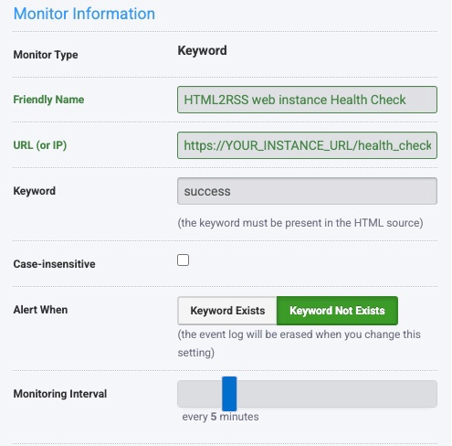

# html2rss-web

[](https://hub.docker.com/r/gilcreator/html2rss-web)

This web application scrapes websites to build and deliver RSS 2.0 feeds.

## Features

- [create your custom feeds](#how-to-build-a-rss-feed)!
- comes with plenty of [included configs](https://github.com/html2rss/html2rss-configs) out of the box.
- handles request caching.
- sets caching related HTTP headers.

This application is intended for Docker usage and is designed to need as little maintenance as possible. See [Versioning and Releases](#versioning-and-releases) and consider automatic updates (with _watchtower_ -- keep reading).

The functionality of scraping websites and building the RSS is provided by the Ruby gem [`html2rss`](https://github.com/html2rss/html2rss).

## Get started

### with Docker

```sh
docker run -p 3000:3000 gilcreator/html2rss-web
```

and open <http://127.0.0.1:3000/> in your browser.

This is the quickest way to get started. However, it's also the one with least flexibility: it doesn't allow to use custom feed configs and doesn't update automatically.

If you wish more flexibility and automatic updates sounds good to you, read on how to get started _with docker-compose_...

### with docker-compose

Create a `docker-compose.yml` and paste the following into it:

```yml
version: "3"
services:
  html2rss-web:
    image: gilcreator/html2rss-web
    ports:
      - "3000:3000"
    volumes:
      - type: bind
        source: ./feeds.yml
        target: /app/config/feeds.yml
        read_only: true
    environment:
      - RACK_ENV=production
  watchtower:
    image: containrrr/watchtower
    volumes:
      - /var/run/docker.sock:/var/run/docker.sock
      - "~/.docker/config.json:/config.json"
    command: --cleanup --interval 7200
```

Start it up per: `docker-compose up`.

If you did not create your `feeds.yml` yet, download [this `feeds.yml` as blueprint](https://raw.githubusercontent.com/html2rss/html2rss-web/master/config/feeds.yml) into the directory containing the `docker-compose.yml`.

## Docker: automatically keep the html2rss-web image up-to-date

The [watchtower](https://containrrr.dev/watchtower/) service automatically pulls running docker images and checks for updates. If an update is available, it will automatically start the updated image with the same configuration as the running one. Please read its manual.

The `docker-compose.yml` above contains a service description for watchtower.

## How to use the included configs

html2rss-web comes with many feed configs out of the box. [See file list of all configs.](https://github.com/html2rss/html2rss-configs/tree/master/lib/html2rss/configs)

To use a config from there, build the URL like this:

The _feed config_ you'd like to use:
`lib/html2rss/configs/domainname.tld/whatever.yml`
`‌ ‌ ‌ ‌ ‌ ‌ ‌ ‌ ‌ ‌ ‌ ‌ ‌ ‌ ‌ ‌ ‌ ‌ ‌ ‌ ‌ ‌^^^^^^^^^^^^^^^^^^^^^^^^^^^`

The corresponding URL:
`http://localhost:3000/domainname.tld/whatever.rss`
`‌ ‌ ‌ ‌ ‌ ‌ ‌ ‌ ‌ ‌ ‌ ‌ ‌ ‌ ‌ ‌ ‌ ‌ ‌ ‌ ‌ ‌ ^^^^^^^^^^^^^^^^^^^^^^^^^^^`

## How to build your RSS feeds

To build your own RSS feed, you need to create a _feed config_.
That _feed config_ goes into the file `feeds.yml`.
Check out the [`example` feed config](https://github.com/html2rss/html2rss-web/blob/master/config/feeds.yml#L9).

Please refer to [html2rss' README for a description of _the feed config and its options_](https://github.com/html2rss/html2rss#the-feed-config-and-its-options). html2rss-web is just a small web application which depends on html2rss.

## Versioning and releases

This web application is distributed in a [rolling release](https://en.wikipedia.org/wiki/Rolling_release) fashion from the `master` branch.

For the latest commit passing the Github CI/CD on the master branch, an updated Docker image will be pushed to Docker Hub: `gilcreator/html2rss-web`](<https://hub.docker.com/r/gilcreator/html2rss-web>).

Github's @dependabot is enabled for dependency updates and are automatically merged to the `master` branch when the CI gives the green light.

If you use Docker, you should update to the latest image automatically, by [setting up _watchtower_ as described](#get-started).

## Use in production

This app is published on Docker Hub and therefore easy to use with Docker.
The above `docker-compose.yml` is a good starting point.

If you're going to host a public instance, _please please please_:

- put the application behind a reverse proxy.
- allow outside connections only via HTTPS.
- have an auto update strategy (e.g. watchtower).
- monitor your `/health_check.txt` endpoint.
- [let world know and add your instance to the wiki](https://github.com/html2rss/html2rss-web/wiki/Instances) -- thank you!

### Supported ENV variables

| Name                           | Description            |
| ------------------------------ | ---------------------- |
| `PORT`                         | default: 3000          |
| `RACK_ENV`                     | default: 'development' |
| `RACK_TIMEOUT_SERVICE_TIMEOUT` | default: 15            |
| `WEB_CONCURRENCY`              | default: 2             |
| `WEB_MAX_THREADS`              | default: 5             |

### Runtime monitoring via `GET /health_check.txt`

It is recommended to setup a monitoring of the `/health_check.txt` endpoint. With that, you can be notified when one of _your own_ configs break.

The `GET /health_check.txt` endpoint responds with:

- if the feeds are generatable: it will respond with `success` .
- otherwise: it states the broken config names.

[UptimeRobot's free plan](https://uptimerobot.com/) is sufficent for basic monitoring every 5 minutes. Create a monitor of type _Keyword_ with this information:



## Setup for development

Checkout the git repository and ...

### using Docker

This approach allows you to play around without installing Ruby on your machine.
All you need to do is install and run Docker.

```sh
# Build image from Dockerfile and name/tag it as html2rss-web:
docker build -t html2rss-web -f Dockerfile .

# Run the image and name it html2rss-web-dev:
docker run \
  --detach \
  --mount type=bind,source=$(pwd)/config,target=/app/config \
  --name html2rss-web-dev \
  html2rss-web

# Open a interactive TTY with the shell `sh`:
docker exec -ti html2rss-web-dev sh

# Stop and cleanup container
docker stop html2rss-web-dev
docker rm html2rss-web-dev

# Remove the image
docker rmi html2rss-web
```

### using installed Ruby

If you're comfortable with installing Ruby directly on your machine, follow these instructions:

1. Install Ruby `>= 3.1`
2. `gem install bundler foreman`
3. `bundle`
4. `foreman start`

_html2rss-web_ now listens on port **5**000 for requests.
