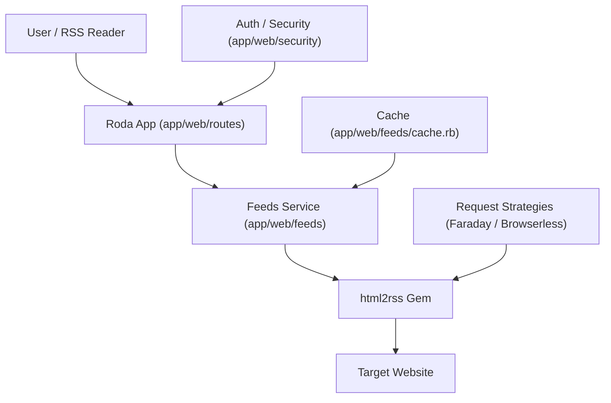

# Architecture & Request Lifecycle

This document provides a mental model of how `html2rss-web` processes requests.

## High-Level Data Flow

## Request Lifecycle

### 1. Routing & Auth

Requests enter via `app.rb` and are dispatched to `app/web/routes/`.

- **API v1**: Authenticated via `app/web/security/auth.rb`.
- **Public Feeds**: Validated via HMAC tokens in `app/web/security/feed_token.rb`.

### 2. Resolution

The `Html2rss::Web::Feeds::SourceResolver` determines where the feed configuration comes from:

- **Static**: Pre-defined in `config/feeds.yml`.
- **Dynamic**: Generated on-the-fly via the `/api/v1/feeds` endpoint (AutoSource).

### 3. Fetching & Rendering

The `Html2rss::Web::Feeds::Service` orchestrates the extraction:

1. Checks the `Html2rss::Web::Feeds::Cache`.
2. If stale/missing, calls the `html2rss` gem with the resolved strategy.
3. Renders the output using `RssRenderer` (XML) or `JsonRenderer`.

## Extension Points

### Adding a Request Strategy

Strategies are defined by the `html2rss` gem but can be configured here.

- **Faraday**: Default HTTP client for static HTML.
- **Browserless**: Used for JavaScript-heavy websites.

To add or configure strategies, see `app/web/feeds/source_resolver.rb` and the `html2rss` gem documentation.
