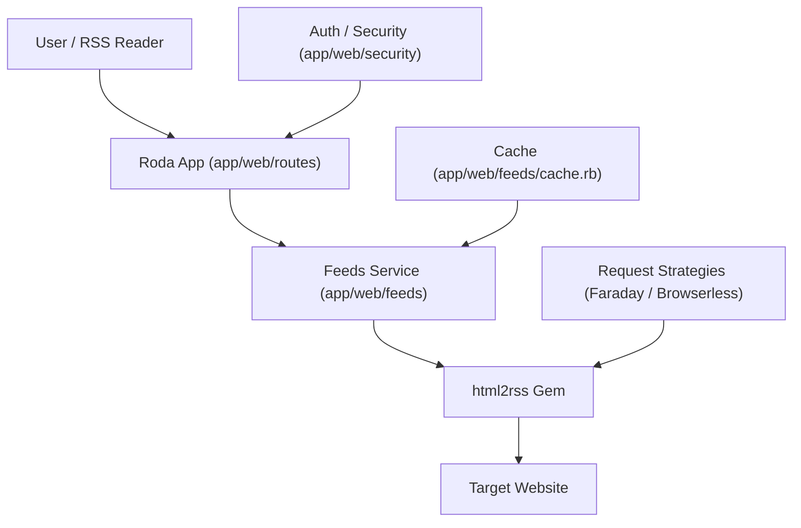

# Architecture & Request Lifecycle

This document provides a mental model of how `html2rss-web` processes requests.

## High-Level Data Flow

## Request Lifecycle

### 1. Routing & Auth

Requests enter via `app.rb` and are dispatched to `app/web/routes/`.

- **Static feed pages (`/<feed_name>`)**: Routed by `app/web/routes/feed_pages.rb` and resolved as `target_kind: :static`.
  - Source: static config in `config/feeds.yml` (via `LocalConfig.find`).
  - Auth boundary: no feed token required on this route.
  - Failure mode: unknown feed names fail at static config lookup.
- **Token-backed feed reads (`/api/v1/feeds/:token`)**: Routed by `app/web/routes/api_v1/feed_routes.rb` and resolved as `target_kind: :token`.
  - Token scope: `FeedAccess.authorize_feed_token!` validates signature/expiry and re-checks account URL access.
  - Constraint: disabled when AutoSource is off (`ForbiddenError` from `SourceResolver.ensure_auto_source_enabled!`).
- **Feed creation (`POST /api/v1/feeds`)**: Authenticated via bearer token in `app/web/security/auth.rb`; this endpoint mints feed tokens for subsequent token-backed reads.

### 2. Resolution

The `Html2rss::Web::Feeds::SourceResolver` determines where feed configuration comes from based on route target:

- **Static (`target_kind: :static`)**: Pre-defined in `config/feeds.yml`.
- **Token (`target_kind: :token`)**: Generated from validated feed token payload + AutoSource globals.

### 3. Fetching & Rendering

The `Html2rss::Web::Feeds::Service` orchestrates the extraction:

1. Checks the `Html2rss::Web::Feeds::Cache`.
2. If stale/missing, calls the `html2rss` gem with the resolved strategy.
3. Renders the output using `RssRenderer` (XML) or `JsonRenderer`.

## Extension Points

### Adding a Request Strategy

Strategies are defined by the `html2rss` gem but can be configured here.

- **Faraday**: Default HTTP client for static HTML.
- **Browserless**: Used for JavaScript-heavy websites.

To add or configure strategies, see `app/web/feeds/source_resolver.rb` and the `html2rss` gem documentation.
