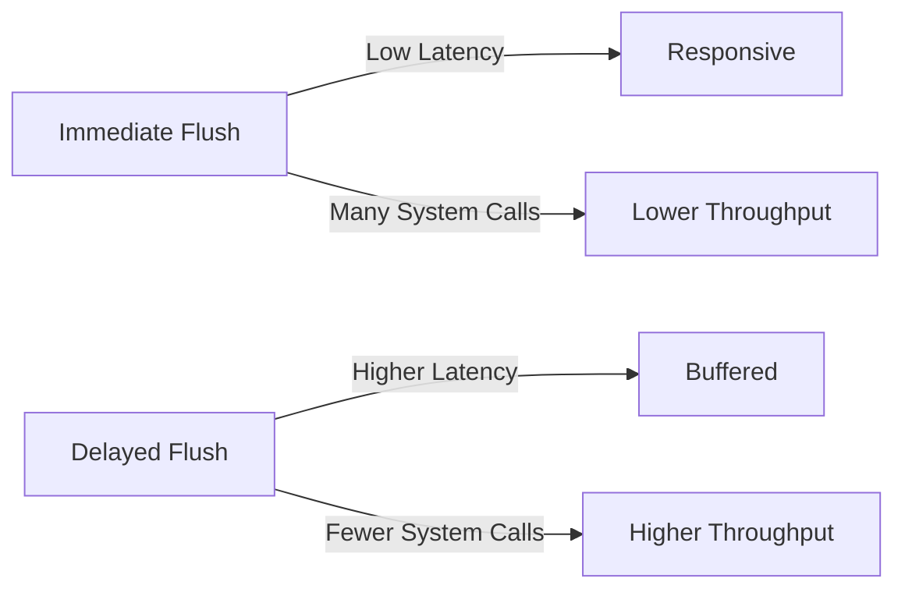

# High Performance IO

This guide explains how to achieve optimal performance when using `io-stream` by understanding and controlling flush behavior.

## Overview

The key to high-performance IO with `io-stream` is understanding when and how to flush your write buffer. Improper flush timing can significantly impact throughput, latency, and CPU usage. This guide helps you choose the right buffering strategy for your application.

## Why Buffering Matters

Every write to an underlying IO object (file, socket, pipe) involves a system call, which has overhead:

- **Context switching**: Transferring control between userspace and kernel space.
- **System call overhead**: The cost of invoking kernel functions.
- **Network packet overhead**: For sockets, each small write may trigger a separate packet.

Buffering solves this by accumulating data in memory and performing larger, less frequent writes. However, buffering introduces latency - data sits in memory until flushed.

Use buffering when you need:
- **High throughput**: Maximize data transfer rate for bulk operations.
- **Reduced CPU usage**: Minimize system call overhead when writing many small pieces.
- **Efficient network utilization**: Avoid sending many tiny packets.

## The Flush/Throughput Tradeoff

There's a fundamental tradeoff between responsiveness and throughput:

**Immediate flushing** (after every write):
- ✅ Data is sent immediately - low latency.
- ✅ Simple mental model - predictable behavior.
- ❌ High system call overhead.
- ❌ Lower maximum throughput.
- ❌ More CPU usage.
- ❌ Network inefficiency (many small packets).

**Buffered flushing** (accumulate before sending):
- ✅ Fewer system calls - higher throughput.
- ✅ Better CPU efficiency.
- ✅ More efficient network packet utilization.
- ❌ Data is delayed - higher latency.
- ❌ Requires careful flush management.

## Automatic Flush Behavior

`io-stream` automatically flushes in these situations:

~~~ ruby
# 1. Buffer reaches minimum_write_size (default: 64KB)
stream.write("x" * 65536)  # Automatically flushes

# 2. Using puts() always flushes
stream.puts("This is flushed immediately")

# 3. Closing the stream
stream.close  # Flushes any remaining data
~~~

## Choosing Your Flush Strategy

### Strategy 1: Let Automatic Flushing Handle It

Best for: Bulk data transfer, file processing, log writing.

~~~ ruby
require 'io/stream'

# Default behavior - automatic flush at 64KB
stream = IO::Stream::Buffered.open("large_file.dat", "w")

# Write lots of data
1000.times do |i|
	stream.write("Record #{i}\n" * 1000)
end

stream.close  # Final flush on close
~~~

**When to use:**
- Writing large amounts of data continuously.
- Throughput is more important than latency.
- You don't need interactive feedback.

### Strategy 2: Manual Flush at Logical Boundaries

Best for: Request/response protocols, transaction processing, structured logging.

~~~ ruby
require 'io/stream'
require 'socket'

socket = TCPSocket.new("example.com", 80)
stream = IO::Stream(socket)

# Build complete HTTP request
stream.write("GET / HTTP/1.1\r\n")
stream.write("Host: example.com\r\n")
stream.write("Connection: close\r\n")
stream.write("\r\n")

# Flush after complete request
stream.flush  # Send request as one operation
~~~

**When to use:**
- Message-based protocols (HTTP, Redis, etc.)
- You need to send complete "units" of data
- Each logical operation should complete atomically
- Balance between throughput and responsiveness

### Strategy 3: Immediate Flush for Interactive Applications

Best for: Chat applications, streaming responses, real-time dashboards.

~~~ ruby
require 'io/stream'

# Use smaller buffer for more frequent automatic flushes
stream = IO::Stream::Buffered.new(
	socket,
	minimum_write_size: 512  # Smaller buffer = more responsive
)

# Or flush after every message
stream.write(message)
stream.flush  # Ensure immediate delivery
~~~

**When to use:**
- Real-time user interaction required.
- Low latency is critical.
- Data arrives in small, discrete chunks.

### Strategy 4: Time-Based Flushing

Best for: Streaming data, progress updates, monitoring

~~~ ruby
require 'io/stream'

stream = IO::Stream::Buffered.open("stream.log", "w")
last_flush = Time.now

loop do
	stream.write(generate_log_entry)
	
	# Flush every second or when buffer is large
	if Time.now - last_flush > 1.0
		stream.flush
		last_flush = Time.now
	end
end
~~~

**When to use:**
- Ensuring regular progress visibility.
- Protecting against data loss (periodic flush to disk).
- Streaming applications with real-time monitoring.

### Strategy 5: Readiness based flushing

Best for: interactive protocols, terminal applications, chat servers.

~~~ ruby
require 'io/stream'

stream = IO::Stream::Buffered.new(socket, minimum_write_size: 1024)

loop do
	# Blocking read from a queue of messages to send:
	chunk = queue.pop
	stream.write(chunk)
	
	if queue.empty?
		# Flush when we are likely to block on the queue:
		stream.flush
	end
end
~~~

**When to use:**
- When you have unpredictable message arrival patterns.
- When you want to ensure the lowest possible latency while still benefiting from buffering when messages arrive in bursts.

## Buffer Size Configuration

The `minimum_write_size` parameter controls when automatic flushing occurs:

~~~ ruby
# Very small buffer - more responsive, lower throughput
stream = IO::Stream::Buffered.new(io, minimum_write_size: 1024)

# Default - balanced (64KB)
stream = IO::Stream::Buffered.new(io)

# Large buffer - maximum throughput, higher latency
stream = IO::Stream::Buffered.new(io, minimum_write_size: 512 * 1024)
~~~

### Choosing Buffer Size

**Small buffers (1-8KB):**
- Interactive protocols (terminal, chat).
- Real-time data visualization.
- Acceptable: Lower throughput.

**Medium buffers (8-64KB):**
- Web servers (default is good).
- Application servers.
- Database connections.
- Balance of throughput and responsiveness.

**Large buffers (64KB-1MB):**
- File processing.
- Bulk data transfer.
- Video encoding.
- Logging systems.
- Only latency-insensitive applications.
